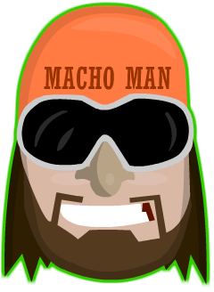
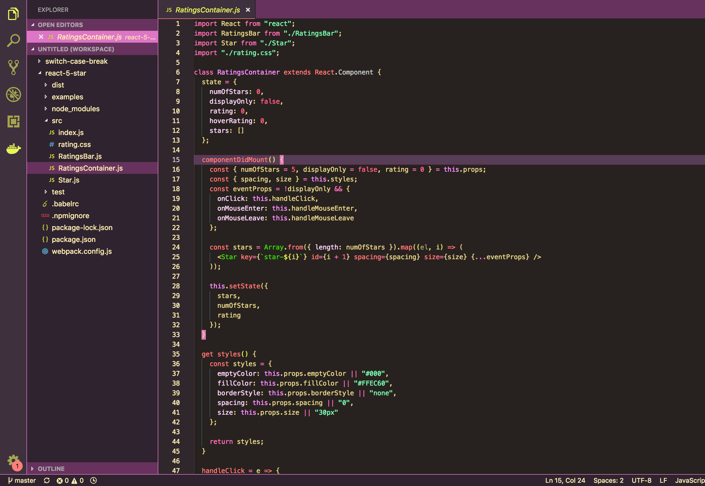

# Macho Man Randy Savage Theme (VS Code)

### How To Install
+ Open **Extensions** in Visual Studio Code. *(View → Extensions)*
+ Search for `Macho Man Randy Savage`. I should probably be the only one.
+ **Install** it and **Reload** your editor!
+ Select it by going to Code → Preferences → Color Theme → ***Macho Man***

### Thanks
Thanks to [Wes Bos](https://twitter.com/wesbos) from who I heavily borrowed the targeted elements for this theme. Check out his [Cobalt2 VSCode Theme](https://github.com/wesbos/cobalt2-vscode).